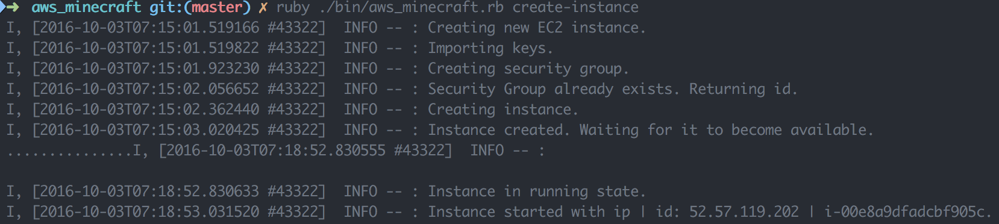
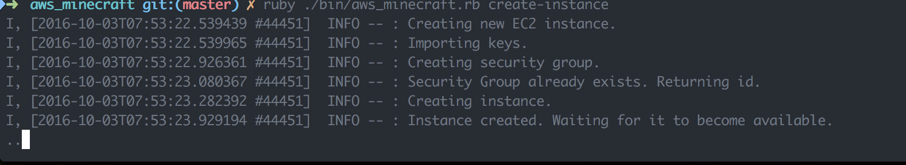
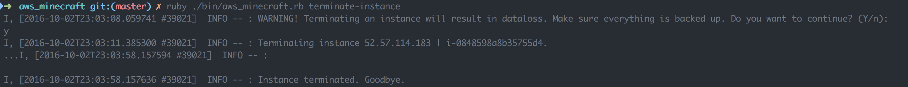
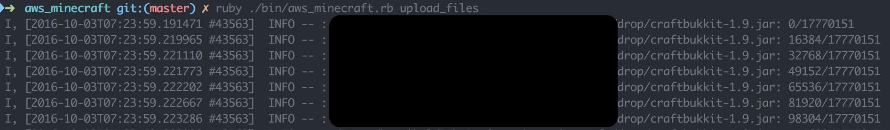
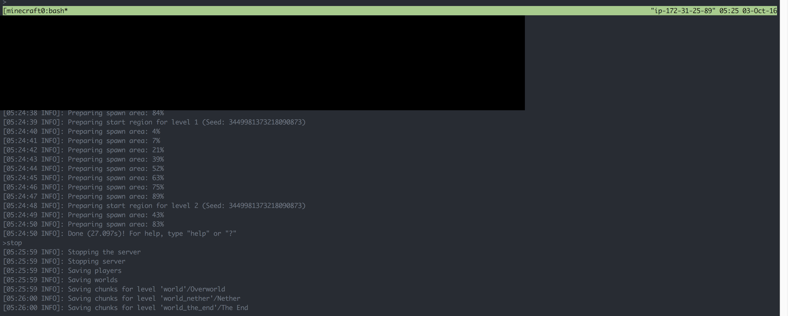
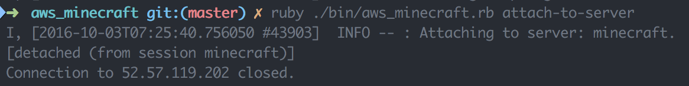
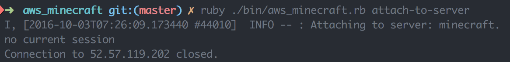
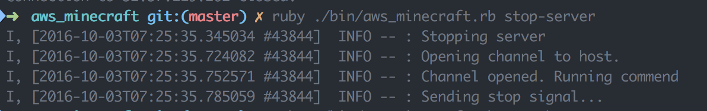

Minecraft Server In The Cloud
=============================

[](https://travis-ci.org/Skarlso/aws_minecraft)

This is a fully provisinable Minecraft server on a configurable EC2 instance under AWS. This Gem
provides the ability to manage both, an EC2 instance and a Minecraft server which is executed on
that EC2 instance.

# Reasons

I have a fully operational Minecraft server at home running on my laptop. My problem was, that
I don't have the infrastructure or the processing power, neither the networking capabilities to host
a server which can handle more than 2 people. All the other solutions out there, costed a lot of
money and investment.

All I needed was a good enough server for at least 5-6 hours / week. This is a rough estimate.
With this kind of usage, my cost, with an t2.large EC2 instance would be around ~3-5 USD / month!
This is a price none of the services currently providing could beat any time soon. A t2.large can
handle a fair amount of people without breaking a sweat. I can shut it down, and start it up again
at any given time. If I'm not using it for a week, it just sits there, and will not incur any costs.
This is again, something that no competitors would be able to match.

The only thing that competitors are matching is maybe ease of usage. And hence, the reason for this
Gem. This CLI ruby gem, will make it so that it's easy, and straightforward to manage an instance
from the command line and to manage a Minecraft server from the command line as well. And here is
how you do that.

# Setup

## AWS

In order for this to work, you'll have to set up an AWS account, which you can do here:[AWS Account Creation](Create Account - Amazon Web Services).
Once that is done, you will need to save your api creds. After that, you'll need to set up the CLI
tool of AWS in order for your environment to be correctly configured for this Gem's CLI tool. To
do that, run through this document: [AWS CLI Setup Runbook](http://docs.aws.amazon.com/cli/latest/userguide/cli-chap-getting-started.html).

TL;DR; => Run `aws configure` and enter your `AWS Access Key ID`, `AWS Secret Access Key`, and default
`region` to use. The region should be a place near you so latency won't be an issue. If you are using
multiple profiles, please set the environment property accordingly `export AWS_DEFAULT_PROFILE=user2`.

Test your CLI by running an AWS command like this one: `aws ec2 describe-instances --output table --region us-east-1`.

## AWS Minecraft Gem

### Install

Version 0.1.0 is deployed as a gem.

```
gem install aws_minecraft
```

Or, in a Gemfile

```
gem 'aws_minecraft'
```

You can also build it yourself. Just clone this repository and use rake.

```
rake install
```

Or

```
bundle exec rake install
```

This will create a gem which will be used under `pkg`. Just bare in mind, that there is a key which needs to be present. The `minecraft.key` file. Without it, you won't be able to build the gem.

### Instance

The instance configuration that is used can be found here: [ec2_config](cfg/ec2_config.json). This
will configure and create an EC2 instance for you. Couple of things to note here. The instance uses
an ssh key import which is than used to execute commands on the instance. So in order for this to work
you'll have to create an SSH key with `ssh-keygen`. Enter your **PUBLIC** key, something like `/Users/youruser/.ssh/ida_rsa.pub`,
into the file called `minecraft.key` as a *base64* encoded string. You can use a public encoder, since
this is your public key. [Base64Encode](https://www.base64encode.org/).

AWS Minecraft uses tmux to run a Minecraft server in the background. The tmux is a multiplexer client
and will allow us to attach to it later on, if the user would like to run some commands on the server.

All this is pre installed on the starting server by this script: [user_data](cfg/user_data.sh).

### AWS Minecraft

AWS Minecraft uses a sqlite3 database to store some information about the instance that the user just
created. This is so, that it's readily available should any query occur so as to not continuously
query amazon for information about the instance.

The [config.yml](cfg/config.yml) file configures this gem. Currently, two settings are available. A
Logger level setting information which can be overridden any time. And second, it's the location from
where files will be uploaded to the instance like, minecraft.jar or craftbukkit.jar. These than will
be executed during starting a Minecraft server.

### DB

The database also needs to be initialised, for this, there is a cli command called init-db. To
initialise the database, run `bundle exec ./bin/aws_minecraft.rb init-db`. This will create a
Minecraft.db file. In case there is anything wrong and you would like to create a new instance, and
you are sure that the one which is saved, is not the correct one, just delete this file and run
`init-db` again.

# Usage

The following commands are available from the CLI tool:
```
Commands:
  aws_minecraft.rb attach-to-server    # Attach to a Minecraft server.
  aws_minecraft.rb create-instance     # Creates an EC2 instance.
  aws_minecraft.rb help [COMMAND]      # Describe available commands or one specific command
  aws_minecraft.rb init-db             # Initialize the databse.
  aws_minecraft.rb ssh                 # SSH into a running EC2 instance.
  aws_minecraft.rb start-instance      # Starts an EC2 instance.
  aws_minecraft.rb start-server NAME   # Starts a Minecraft server.
  aws_minecraft.rb stop-instance       # Stops an EC2 instance.
  aws_minecraft.rb stop-server         # Stops a Minecraft server.
  aws_minecraft.rb terminate-instance  # Terminates an EC2 instance.
  aws_minecraft.rb upload-files        # Uploads everything from drop, not just the world.
  aws_minecraft.rb upload-world        # Upload world.
```

* `attach_to_server` will attach you to a running Minecraft server which you than can control and run
commands on.
* `create-instance` this will create your bare bone EC2 instance with some installed packages.
* `init-db` is explained above
* `ssh` this will ssh into your instance. For this to work, you'll have to load your private key
into the ssh agent which belongs to the public key in your instance. To do this, run ssh-add like this:
`ssh-add ~/.ssh/minecraft_rsa`. **NOTE**: This is an important part. SSH needs to be able to work for
uploading your files and the world as well.
* `start-instance` will start a stopped EC2 instance.
* `start-server NAME` this will start a Minecraft server. NAME here will be the jar you'll upload with
`upload-files`. For example, if you upload `minecraft-server-1.9.jar` than this would be
`aws_minecraft.rb start-server minecraft-server-1.9.jar`.
* `stop-instance` stops your EC2 instance. This is recommended after a session ends, since it would
generate more usage cost if you left it running. **WARNING**: Do NOT forget to stop your EC2 instance.
I'm not responsible for you forgetting to do that. :P
* `stop-server` this stops your running Minecraft server. There is no need for NAME here, since it's
running in a tmux session for which the name is predefined.
* `terminate-instance` this will kill off your EC2 instance. **WARNING**: If you do this, you will loose
all data! There is a prompt before terminate which asks you if you are sure about that.
* `upload-files` this uploads files from a designated location. You would configure this to be a
folder in which your world, and minecraft.jar resides in. Once the upload completes, you can start
your server.
* `upload-world` in order to avoid re-uploading everything, in case you have a new world you'd like
to use, you would only run this and point it at the worlds folder. *NOTE*: Incomplete feature.

## Typical use case

A typical use case would be to install this gem with `gem install aws_minecraft`. Than setup your
AWS creds. Next, create your SSH key and copy the base64 encoded public key under cfg/minecraft.key
(this file is ignored so it won't show up in your repository if you are doing a git clone). Proceed
with creating the database by running `init-db` and than you are ready to create your first EC2 instance.
Run `start-instance`. Once the instance is ready, run `upload-files`. The uploads progress is shown.
When that is finished, you are ready to start your server with `start-server`. This will also give
you the server's ip address which you will need to enter into Minecraft in order to log in. Play.
When you are done playing, don't forget to issue a `stop-server` command.

If you would like to resume playing on the same server, you would call `start-server` and again,
enjoy a nice session of Minecraft.

## Using an existing server configuration with plugins

If you happen to have a server with configured plugins and all that jazz, and you would like to just
continue that on an instance, it's easy to do that. Simply point, in the config.yml file `upload_path:`
to that folder in which your server, world, minecraft jar, craftbukkit jar, sit and upload_file will
upload the contents of that folder to EC2. Start your minecraft jar, and log in to your old world with
everything in tact.

# Examples

Created the instance



Creation in progress with a progress bar showing that it's working



Terminating an instance



Upload files



Attach to a running Minecraft server



Attach-Detach to a running session



Trying to attach to a not running session



Stopping a minecraft server



# Contribution

Any contributions are very welcomed. Please don't hesitate to open an issue even if it is a question only.
The Roadmap outlines things that are missing and would be nice to have.
